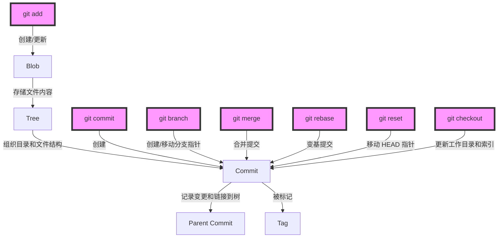
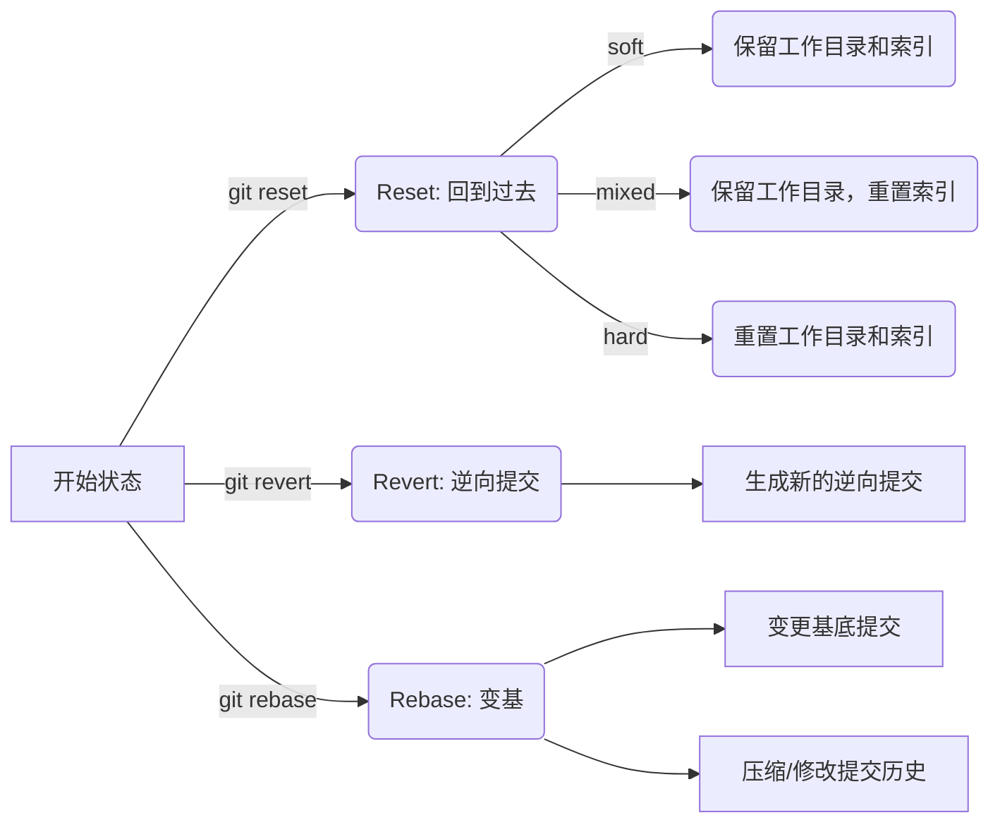
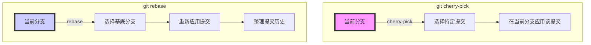

## 1. Git 底层文件对象



```sh
$ ls .git
config #仅供 GitWeb 程序使用
description #项目特有的配置选项
HEAD #指向目前被检出的分支
hooks/ #包含客户端或服务端的钩子脚本（hook scripts）
info/ #包含一个全局性排除（global exclude）文件， 用以放置那些不希望被记录在 .gitignore 文件中的忽略模式（ignored patterns）
objects/ #存储所有数据内容
refs/ #存储指向数据（分支、远程仓库和标签等）的提交对象的指针
index #保存暂存区信息
```

### 1.1 Blob

blob（Binary Large Object）是一种数据类型，用于存储文件的内容。每个文件在 Git 中都被存储为一个 blob 对象。blob 对象包含了文件的原始内容，它们是 Git 中最基本的数据单元之一。

1. **内容存储**：blob 对象存储文件的实际内容。这些内容以二进制格式存储，并且是文件的原始数据。Git 不关心文件的类型，它将所有文件都视为二进制文件，并以 blob 对象的形式存储它们。

2. **唯一标识**：每个 blob 对象都有一个唯一的 SHA-1 哈希值，这个哈希值是通过 blob 对象的内容计算得到的。因为哈希值是根据内容计算的，所以相同内容的 blob 对象具有相同的哈希值，而不同内容的 blob 对象具有不同的哈希值。

3. **不可变性**：一旦创建了一个 blob 对象，它就是不可变的。这意味着 blob 对象的内容不能被修改。如果文件的内容发生了变化，Git 会创建一个新的 blob 对象来存储新内容，并将旧的 blob 对象保留在数据库中。

4. **存储位置**：blob 对象存储在 Git 仓库的 `.git/objects` 目录中。每个 blob 对象都存储在一个以其哈希值命名的文件中。这些文件通常是 zlib 压缩的，以节省存储空间。

5. **版本控制**：blob 对象是 Git 中文件版本控制的基础。通过存储每个文件的内容的 blob 对象，Git 可以跟踪文件的历史变化，并在需要时恢复到特定版本的文件内容。

### 1.2 Tree


tree 对象可以存储文件名，同时也允许存储一组文件。Git 以一种类似 UNIX 文件系统但更简单的方式来存储内容。所有内容以 tree 或 blob 对象存储，其中 tree 对象对应于 UNIX 中的目录，blob 对象则大致对应于 inodes 或文件内容。

```sh
# master^{tree} 表示 branch 分支上最新提交指向的 tree 对象
$ git cat-file -p master^{tree}
    100644 blob a906cb2a4a904a152e80877d4088654daad0c859 README
    100644 blob 8f94139338f9404f26296befa88755fc2598c289 Rakefile
    040000 tree 99f1a6d12cb4b6f19c8655fca46c3ecf317074e0 lib
```

### 1.3 Commit


commit 对象有格式很简单：指明了该时间点项目快照的顶层树对象、作者/提交者信息（从 Git 设置的 user.name 和 user.email 中获得)以及当前时间戳、一个空行，以及提交注释信息。

```sh
$ git cat-file -p fdf4fc3
    tree d8329fc1cc938780ffdd9f94e0d364e0ea74f579
    author Scott Chacon <schacon@gmail.com> 1243040974 -0700
    committer Scott Chacon <schacon@gmail.com> 1243040974 -0700

    first commit
```

每一个 commit 对象都指向了你创建的树对象快照。

### 1.4 Tag

Tag 对象非常像一个 commit 对象——包含一个标签，一组数据，一个消息和一个指针。最主要的区别就是 Tag 对象指向一个 commit 而不是一个 tree。它就像是一个分支引用，但是不会变化——永远指向同一个 commit，仅仅是提供一个更加友好的名字。

```sh
$ cat .git/refs/tags/v1.1
    9585191f37f7b0fb9444f35a9bf50de191beadc2
```

## 2. Git 引用


```sh
$ find .git/refs
    .git/refs
    .git/refs/heads
    .git/refs/tags
```

## 3. reset & revert & rebase

1. **`git reset`**：

   - 本质：`git reset` 主要用于移动 HEAD 指针，并且可以改变当前分支的状态。它可以撤销提交、移动 HEAD 到不同的提交或分支，以及更改暂存区和工作目录的状态。
   - 适用场景：`git reset` 适用于需要撤销提交、移动 HEAD 或重置暂存区和工作目录的情况。例如，你可以使用 `git reset --hard` 来彻底取消之前的提交并且清除暂存区和工作目录中的所有更改。

2. **`git revert`**：

   - 本质：`git revert` 主要用于撤销一个或多个提交，并且会创建新的提交来记录撤销的操作。它不会改变历史提交，而是在历史提交之上创建新的提交来反转之前的更改。
   - 适用场景：`git revert` 适用于需要撤销特定提交而不改变历史记录的情况。例如，当你需要撤销一个错误的提交，但同时又希望保留原有的提交历史时，可以使用 `git revert`。

3. **`git rebase`**：
   - 本质：`git rebase` 主要用于将一个分支的提交应用到另一个分支上，并且可以重新应用提交历史以改变提交的顺序或合并提交。它通过将一系列提交转移至另一个分支上来实现这个目的。
   - 适用场景：`git rebase` 适用于需要在不同分支之间移动或合并提交历史的情况。例如，当你需要将一个分支的提交应用到另一个分支上时，可以使用 `git rebase` 来移动提交。另外，`git rebase` 也可以用于合并提交、清理提交历史以及保持一个干净的历史记录。

`git reset` 适用于撤销提交、移动 HEAD 和重置状态的情况；`git revert` 适用于撤销特定提交而不改变历史记录的情况；`git rebase` 适用于在不同分支之间移动或合并提交历史的情况。通常情况下，`git reset` 更适合操作当下分支，而 `git rebase` 更适合操作多个分支。



## 4. cherry-pick & rebase

### Git Cherry-pick


**功能**: `git cherry-pick` 命令用于将其他分支上的提交应用到当前分支。它允许你选择一个或多个提交，并将这些提交作为新的提交引入到当前分支。

**使用场景**:

1. **特定提交的应用**: 当你只想从另一个分支取得特定的提交时，而不是整个分支的内容，可以使用 `cherry-pick`。
2. **修复错误**: 如果在一个分支上修复了一个 bug，而这个修复需要应用到其他分支上，但不需要其他更改时，可以使用 `cherry-pick`。
3. **代码回滚**: 在某些情况下，如果某个功能在被合并到主分支之后出现问题，你可能需要将这个功能的提交从主分支上移除。`cherry-pick` 可以用来选择性地撤销特定的提交。

### Git Rebase


**功能**: `git rebase` 命令用于将一个分支的修改重新应用在另一个分支之上。它常用于保持一个干净的项目历史，通过将一系列的提交“重新播放”在另一分支上。

**使用场景**:

1. **保持线性历史**: 在合并特性分支之前，使用 `rebase` 可以保证一个线性的提交历史，这使得历史更容易理解和导航。
2. **避免不必要的合并提交**: 当你需要将最新的主分支变更合并到你的特性分支时，使用 `rebase` 而不是 `merge` 可以避免生成额外的合并提交。
3. **整理提交**: 在将特性分支合并到主分支前，你可以使用 `rebase` 来压缩（squash）或重新排序提交，以创建一个更清晰的提交历史。

### 区别

- **操作对象**: `cherry-pick` 是针对特定的提交操作，而 `rebase` 是对一系列提交的重新整理和应用。
- **历史改写**: `rebase` 会改写历史，`cherry-pick` 则在当前分支上创建新的提交。
- **使用目的**: `cherry-pick` 主要用于特定提交的应用，而 `rebase` 用于历史整理和保持项目历史的线性。



## 5. 场景：仅下载需要的分支

在处理大型仓库时尤其有用，可以节省时间和资源。

当你想要通过 `git clone` 克隆仓库时，但只想克隆特定分支的内容，你可以使用 `--single-branch` 选项。这个选项告诉 Git 只克隆指定的分支，而不是克隆所有分支的内容。

这里是具体的命令格式：

```bash
git clone --single-branch --branch <branchname> <repository-url>
```

- `--single-branch`: 这个选项限制 Git 只克隆指定的单个分支。
- `--branch <branchname>`: 这里 `<branchname>` 是你想要克隆的分支名称。
- `<repository-url>`: 这是你想要克隆的远程仓库的 URL。

例如，如果你只想克隆远程仓库中名为 `develop` 的分支，你可以运行：

```bash
git clone --single-branch --branch develop https://github.com/example/repository.git
```

这个命令会创建一个新的仓库副本，其中只包含 `develop` 分支的内容。

请注意，使用 `--single-branch` 时，克隆的仓库将只有一个追踪分支。这意味着你不会看到远程仓库中的其他分支，除非你手动添加追踪分支或者改变克隆的配置来包含更多分支。

### 5.1 查看所有远程分支

```sh
git fetch --all
git branch -r
```

这里，`git fetch --all` 会从远程获取所有分支的信息（但不下载这些分支的内容），而 `git branch -r` 会列出所有远程分支。

### 5.2 按需下载特定分支

```sh
git checkout -b [branch-name] origin/[branch-name]
```

这里，`[branch-name]` 是你想要检出的远程分支名。这条命令会创建一个新的本地分支，它跟踪对应的远程分支，并下载该远程分支的内容。

通过这种方式，你可以按需查看和下载远程仓库中的任何分支，而不需要一开始就下载所有分支的数据。这在处理大型仓库时尤其有用，可以节省时间和资源。

## 6. 场景：修改 commit 作者信息

如果提交过程中 `username` 和 `email` 提交操作了，需要批量修正，如把所有 `aaa@aaa.com` 的邮箱改为`bbb@bbb.com`，并把用户名`aaa`改为`bbb`，则可以用下面命令处理：

Unix：

```sh
git filter-branch --env-filter '
OLD_EMAIL="aaa@aaa.com"
CORRECT_NAME="bbb"
CORRECT_EMAIL="bbb@bbb.com"
if [ "$GIT_COMMITTER_EMAIL" = "$OLD_EMAIL" ]
then
    export GIT_COMMITTER_NAME="$CORRECT_NAME"
    export GIT_COMMITTER_EMAIL="$CORRECT_EMAIL"
fi
if [ "$GIT_AUTHOR_EMAIL" = "$OLD_EMAIL" ]
then
    export GIT_AUTHOR_NAME="$CORRECT_NAME"
    export GIT_AUTHOR_EMAIL="$CORRECT_EMAIL"
fi
' --tag-name-filter cat -- --branches --tags
```

PowerShell：

```sh
git filter-branch --env-filter '
$OLD_EMAIL="aaa@aaa.com"
$CORRECT_NAME="bbb"
$CORRECT_EMAIL="bbb@bbb.com"
if ($Env:GIT_COMMITTER_EMAIL -eq $OLD_EMAIL) {
    $Env:GIT_COMMITTER_NAME=$CORRECT_NAME
    $Env:GIT_COMMITTER_EMAIL=$CORRECT_EMAIL
}
if ($Env:GIT_AUTHOR_EMAIL -eq $OLD_EMAIL) {
    $Env:GIT_AUTHOR_NAME=$CORRECT_NAME
    $Env:GIT_AUTHOR_EMAIL=$CORRECT_EMAIL
}
' --tag-name-filter cat -- --branches --tags
```

## 7. 场景：产出大文件提交

删除历史中误提交的大文件，如 `a.mp4`、`b.mp4`：

```sh
git filter-branch --force --index-filter \
"git rm --cached --ignore-unmatch a.mp4 b.mp4" \
--prune-empty --tag-name-filter cat -- --all
```

PowerShell：

```sh
git filter-branch --force --index-filter `
"git rm --cached --ignore-unmatch a.mp4 b.mp4" `
--prune-empty --tag-name-filter cat -- --all
```

随后可以加入 `.gitignore`中。

## 8. 场景：删除 node_modules 提交

```sh
git filter-branch --force --index-filter "git rm -r --cached --ignore-unmatch node_modules" --prune-empty --tag-name-filter cat -- --all
```

可以顺道清理下仓库：

```sh
git reflog expire --expire=now --all
git gc --prune=now --aggressive
```

## 9. 场景：产出提交中的私密信息

某个文件中含有秘钥，清楚秘钥。如将 `123 456`替换为 `***`：

```sh
git filter-branch --force --index-filter \
"git ls-files -z | xargs -0 sed -i'' -e 's/123 456/\*\*\*/g' \
--prune-empty --tag-name-filter cat -- --all
```

制定文件替换，如`~/dir1/file1.txt`：

```sh
git filter-branch --force --index-filter \
"git ls-files -z | xargs -0 sed -i'' -e 's/123 456/\*\*\*/g' -- ~/dir1/file1.txt" \
--prune-empty --tag-name-filter cat -- --all
```
