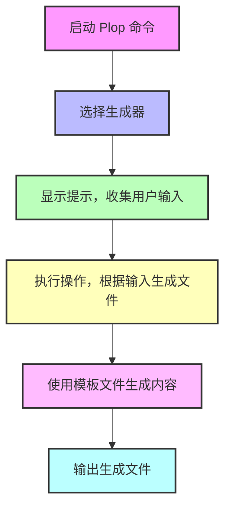

https://github.com/plopjs/plop

## 1. Plop

Plop 是一个小型的命令行工具，专注于帮助开发者自动生成代码片段和文件结构，类似于代码生成器。它可以通过简单的模板定义和 CLI（命令行界面）交互，在项目中快速生成预定义的代码片段，从而提升开发效率。

### Plop 的主要功能

1. **模板生成**：通过模板和自定义脚本，生成特定的代码或文件结构。通常用于创建组件、服务、模块等常用代码片段。
2. **快速配置**：使用简单的 JavaScript 配置文件 `plopfile.js` 来定义生成器，避免手动创建重复的代码。
3. **交互式 CLI**：运行 `plop` 后，它会提示输入相关参数，并根据这些参数生成定制的代码。
4. **灵活性**：支持自定义脚本和多种模板格式，适用于不同类型的项目（如 React、Vue 等框架）。

## 2. 诞生背景

为了帮助开发者简化代码生成和项目中的重复性操作。尤其是在前端开发中，开发者通常会创建大量的类似代码结构（如组件、服务模块、Redux actions 等），这些操作容易出错且耗时。Plop 的设计初衷就是以简单、灵活的方式，帮助开发者快速生成标准化的代码结构和文件，从而减少手动创建的工作量。

### Plop 诞生背景与要解决的问题

1. **减少重复性代码创建**：前端和全栈开发项目中，常见的文件和组件需要遵循统一的结构和命名规则，手动创建不仅繁琐，而且容易出错。Plop 能够将这些操作自动化，确保一致性。
2. **提升开发效率**：对于团队而言，代码模板生成工具能帮助快速搭建项目框架、减少开发者在基础文件上的时间投入，使其将精力集中在业务逻辑和核心功能开发上。
3. **支持模板化和定制化**：与传统的文件拷贝方法相比，Plop 的交互式 CLI 和自定义模板系统，能根据用户输入创建定制化文件内容，从而满足更灵活的需求。

## 3. Plop 与竞品对比

在代码生成方面，Plop 的竞品主要有 Yeoman、Hygen、Slush 等。这些工具的核心功能类似，但侧重点略有不同：

1. **Yeoman**：

   - **特点**：Yeoman 是更大型的项目生成器，包含丰富的生成器插件生态系统，支持从项目模板到文件结构的自动生成。Yeoman 适用于初始化复杂项目。
   - **优缺点**：功能非常强大，但配置复杂，依赖于庞大的插件生态，适合大型项目的初始化，但不如 Plop 轻便。
   - **适用场景**：更适合用作项目初始模板生成，而不是简单的文件或组件生成。

2. **Hygen**：

   - **特点**：Hygen 是另一个文件生成工具，主要通过模板来快速生成代码，并且支持纯本地运行，无需依赖外部包。
   - **优缺点**：相比 Plop，Hygen 更加偏向脚本式运行，可以用配置文件定义一系列生成操作，并通过命令行运行。但其灵活性不及 Plop，交互性较差。
   - **适用场景**：适用于项目中的静态文件生成或模板代码生成。

3. **Slush**：
   - **特点**：Slush 是基于 Gulp 的项目生成器工具，以任务流的方式自动化代码生成。
   - **优缺点**：依赖 Gulp，对代码生成流程有较多定制需求的开发者可能会喜欢，但整体配置相对繁琐。
   - **适用场景**：适合复杂任务流的代码生成场景，但不如 Plop 轻量和易上手。

### 为什么选择 Plop

Plop 的优势在于：

- **简单易用**：配置文件简单明了，适合快速上手。
- **灵活性**：可以根据需求定制生成器，与现有项目无缝集成。
- **CLI 交互友好**：支持用户输入动态生成代码，适合文件和代码片段生成。

## 4. 核心构成

Plop 的核心构成可以分为以下几个部分：

1. **生成器（Generator）**：生成器是 Plop 的基本构成单位，负责定义代码生成的规则。每个生成器都是由一系列提示和操作组成的，描述了代码生成的逻辑。

2. **提示（Prompts）**：提示用于收集用户输入的参数，如文件名称、路径等。这些输入会被传递给后续的操作，用于动态生成内容。Plop 使用 [Inquirer.js](https://github.com/SBoudrias/Inquirer.js) 来处理交互式 CLI 提示。

3. **操作（Actions）**：操作是生成器的核心，它定义了在生成过程中如何处理用户的输入。例如，操作可以将模板内容写入文件、追加内容到文件中、或是执行自定义脚本。Plop 内置了一些基本操作类型（如 `add`、`modify`），同时也支持自定义操作。

4. **模板（Templates）**：Plop 使用 Handlebars 语法来处理模板，使得生成的文件内容能够包含动态内容（如变量、循环等）。模板文件通常保存在 `plop-templates` 目录中，Plop 读取这些模板并替换变量生成最终代码文件。



```js
export default function (plop) {
  // create your generators here
  plop.setGenerator("basics", {
    description: "this is a skeleton plopfile",
    prompts: [], // array of inquirer prompts
    actions: [], // array of actions
  });
}
```

## 5. 快速上手

以下是使用 Plop 快速生成 Vue 3 组件的上手示例。

### Step 1: 安装 Plop

首先，全局安装 Plop：

```bash
npm install -g plop
```

### Step 2: 在项目中创建 `plopfile.js`

在项目根目录创建一个 `plopfile.js` 文件，定义生成器逻辑。我们创建一个 `component` 生成器，用于生成 Vue 3 组件文件。

```javascript
module.exports = function (plop) {
  plop.setGenerator("component", {
    description: "Create a new Vue 3 component",
    prompts: [
      {
        type: "input",
        name: "name",
        message: "Component name:",
      },
    ],
    actions: [
      {
        type: "add",
        path: "src/components/{{pascalCase name}}.vue",
        templateFile: "plop-templates/Component.vue.hbs",
      },
      {
        type: "add",
        path: "src/components/{{pascalCase name}}.css",
        templateFile: "plop-templates/Component.css.hbs",
      },
    ],
  });
};
```

在这个文件中，我们定义了一个 `component` 生成器：

- **`prompts`**：提示用户输入组件名称。
- **`actions`**：根据用户输入生成 Vue 文件和 CSS 文件，路径和模板文件使用变量来生成动态内容。

### Step 3: 创建模板文件

在项目根目录下创建 `plop-templates` 文件夹，并添加两个模板文件：`Component.vue.hbs` 和 `Component.css.hbs`。

- **`Component.vue.hbs`**：

  ```html
  <template>
    <div class="{{camelCase name}}">
      <h1>{{pascalCase name}} Component</h1>
    </div>
  </template>

  <script>
  import './{{pascalCase name}}.css';

  export default {
    name: '{{pascalCase name}}'
  };
  </script>

  <style scoped>
  </style>
  ```

- **`Component.css.hbs`**：

  ```css
  .{{camelCase name}} {
    /* Add your styles here */
  }
  ```

这里使用了 `{{pascalCase name}}` 和 `{{camelCase name}}`，根据用户输入将组件名称转为不同格式。

### Step 4: 使用 Plop 生成组件

在项目根目录运行以下命令：

```bash
plop
```

会看到 Plop 的交互界面，选择 `component` 生成器：

```bash
[plop] Please choose a generator.
? component: Create a new Vue 3 component
```

然后 Plop 会提示输入组件名称，比如 `MyComponent`：

```bash
? Component name: MyComponent
```

根据输入的组件名称，Plop 会生成以下两个文件：

1. **`src/components/MyComponent.vue`**：

   ```html
   <template>
     <div class="myComponent">
       <h1>MyComponent Component</h1>
     </div>
   </template>

   <script>
   import './MyComponent.css';

   export default {
     name: 'MyComponent'
   };
   </script>

   <style scoped>
   </style>
   ```

2. **`src/components/MyComponent.css`**：

   ```css
   .myComponent {
     /* Add your styles here */
   }
   ```

## 6. 方法

| 方法            | 参数                                | 返回值          | 描述                                                         |
| --------------- | ----------------------------------- | --------------- | ------------------------------------------------------------ |
| `setGenerator`  | `String`, `GeneratorConfig`         | `PlopGenerator` | 设置一个生成器                                               |
| `setHelper`     | `String`, `Function`                |                 | 设置一个 Handlebars 助手函数                                 |
| `setPartial`    | `String`, `String`                  |                 | 设置一个 Handlebars partial 模板片段                         |
| `setActionType` | `String`, `CustomAction`            |                 | 注册一个自定义的操作类型                                     |
| `setPrompt`     | `String`, `InquirerPrompt`          |                 | 使用 Inquirer 注册一个自定义的提示类型                       |
| `load`          | `Array[String]`, `Object`, `Object` |                 | 从另一个 plopfile 或 npm 模块加载生成器、助手或 partial 模板 |

### 1. `setGenerator`

用于定义一个生成器。在 Plop.js 中，生成器是一个集合，包含生成文件所需的模板、操作和用户输入提示。

**示例：**

```javascript
plop.setGenerator("component", {
  description: "创建一个新的组件",
  prompts: [
    {
      type: "input",
      name: "name",
      message: "组件名称是什么？",
    },
  ],
  actions: [
    {
      type: "add",
      path: "src/components/{{name}}.js",
      templateFile: "plop-templates/component.hbs",
    },
  ],
});
```

### 2. `setHelper`

用于注册一个 Handlebars helper 函数。在模板中，可以使用 helper 处理或格式化数据。

**示例：**

```javascript
plop.setHelper("uppercase", (text) => text.toUpperCase());
```

在模板中，可以这样使用该 helper：

```handlebars
<p>{{uppercase name}}</p>
```

### 3. `setPartial`

用于注册一个 Handlebars 部分模板（partial），partial 可以用于模板复用。

**示例：**

```javascript
plop.setPartial("myPartial", "<div>部分模板内容：{{name}}</div>");
```

在主模板中，可以通过 `{{> myPartial}}` 引用该部分模板：

```handlebars
<div>
  {{> myPartial}}
</div>
```

### 4. `setActionType`

注册一个自定义的操作类型，用于扩展生成器的操作（默认操作有 `add`、`modify` 等）。

**示例：**

```javascript
plop.setActionType("customLog", (answers, config) => {
  console.log(`自定义日志操作：${config.message}`);
  return "日志已输出";
});

// 在生成器中使用
plop.setGenerator("logExample", {
  description: "示例生成器，包含自定义日志操作",
  actions: [
    {
      type: "customLog",
      message: "Hello from custom action!",
    },
  ],
});
```

### 5. `setPrompt`

注册一个自定义的提示类型，扩展 Inquirer.js 提示种类。

**示例：**

```javascript
const inquirerDate = require("inquirer-datepicker");
plop.setPrompt("date", inquirerDate);

// 使用自定义提示
plop.setGenerator("birthday", {
  description: "输入生日日期",
  prompts: [
    {
      type: "date",
      name: "birthday",
      message: "你的生日是什么时候？",
    },
  ],
  actions: [
    {
      type: "add",
      path: "src/birthday.txt",
      template: "生日：{{birthday}}",
    },
  ],
});
```

### 6. `load`

用于从其他 plopfile 或 npm 模块中加载生成器、助手或 partial。

**示例：**

```javascript
// 加载本地 plopfile 模块
plop.load("./path/to/other/plopfile.js");

// 加载 npm 模块
plop.load("plop-pack-fancy-generators");
```

| 方法                | 参数               | 返回值            | 描述                                                                                         |
| ------------------- | ------------------ | ----------------- | -------------------------------------------------------------------------------------------- |
| `getHelper`         | `String`           | `Function`        | 获取指定名称的助手函数                                                                       |
| `getHelperList`     |                    | `Array[String]`   | 获取所有助手函数名称的列表                                                                   |
| `getPartial`        | `String`           | `String`          | 通过名称获取一个 Handlebars partial 模板片段                                                 |
| `getPartialList`    |                    | `Array[String]`   | 获取所有 partial 模板片段名称的列表                                                          |
| `getActionType`     | `String`           | `CustomAction`    | 通过名称获取一个自定义的操作类型                                                             |
| `getActionTypeList` |                    | `Array[String]`   | 获取所有自定义操作类型名称的列表                                                             |
| `setWelcomeMessage` | `String`           |                   | 自定义 Plop 运行时的欢迎信息（即选择生成器时显示的消息）                                     |
| `getGenerator`      | `String`           | `GeneratorConfig` | 通过名称获取一个生成器                                                                       |
| `getGeneratorList`  |                    | `Array[Object]`   | 获取所有生成器名称及描述的数组                                                               |
| `setPlopfilePath`   | `String`           |                   | 设置 plopfilePath 值，用于在内部定位模板文件等资源                                           |
| `getPlopfilePath`   |                    | `String`          | 返回当前使用的 plopfile 的绝对路径                                                           |
| `getDestBasePath`   |                    | `String`          | 返回用于创建文件的基准路径                                                                   |
| `setDefaultInclude` | `Object`           | `Object`          | 设置当前 plopfile 的默认配置（若被其他 plopfile 引入时将使用此默认配置）                     |
| `getDefaultInclude` | `String`           | `Object`          | 获取当前 plopfile 的默认配置（若被其他 plopfile 引入时将使用此默认配置）                     |
| `renderString`      | `String`, `Object` | `String`          | 使用 Handlebars 渲染模板字符串（第一个参数），并用第二个参数提供的数据填充模板，返回渲染结果 |

## 7. 内置 Actions

| Action 类型 | 描述               | 必需参数                               | 示例                                                                       |
| ----------- | ------------------ | -------------------------------------- | -------------------------------------------------------------------------- |
| `add`       | 创建一个新文件     | `path`, `template` 或 `templateFile`   | 在 `src` 文件夹下创建一个新的组件文件。<br>示例见下方代码块。              |
| `addMany`   | 批量创建多个文件   | `destination`, `base`, `templateFiles` | 从指定的模板批量创建多个文件到目标文件夹中。<br>示例见下方代码块。         |
| `modify`    | 修改已有文件的内容 | `path`, `pattern`, `template`          | 在已有文件中替换或插入内容，可用于更新导出、路由等。<br>示例见下方代码块。 |
| `custom`    | 执行自定义操作     | `function`                             | 执行自定义的 JavaScript 函数，可以执行特定的操作。<br>示例见下方代码块。   |

### 1. `add`

用于创建新文件。可以在指定路径生成一个新文件，并将模板填充到该文件中。

**示例**：

```javascript
{
  type: 'add',
  path: 'src/components/{{name}}.js',
  templateFile: 'plop-templates/component.hbs'
}
```

上述代码将会根据 `component.hbs` 模板创建一个新的组件文件，路径为 `src/components/{{name}}.js`，其中 `{{name}}` 会被替换为用户输入的名称。

### 2. `addMany`

用于批量创建多个文件，通常用于生成多个文件或整个文件夹结构。

**示例**：

```javascript
{
  type: 'addMany',
  destination: 'src/components/{{name}}',
  base: 'plop-templates/component',
  templateFiles: 'plop-templates/component/*.hbs'
}
```

该 `addMany` 操作会在 `src/components/{{name}}` 目录下创建多个文件，基于 `plop-templates/component` 目录中的 `.hbs` 模板文件。

### 3. `modify`

用于修改已存在的文件，可以使用正则表达式定位插入点或进行替换。

**示例**：

```javascript
{
  type: 'modify',
  path: 'src/index.js',
  pattern: /\/\/ Components export/,
  template: "export { default as {{name}} } from './{{name}}';"
}
```

此 `modify` 操作会在 `src/index.js` 文件中，找到 `// Components export` 标记的位置，然后插入或替换模板内容 `export { default as {{name}} } from './{{name}}';`。

### 4. `custom`

用于执行自定义操作。通过传入一个函数，可以灵活定义任何操作逻辑。

**示例**：

```javascript
{
  type: "custom",
    function (answers, config, plop) {
      console.log(`Generating custom files for ${answers.name}`);
      return `Custom action completed for ${answers.name}`;
    };
}
```

上述代码中的 `custom` 操作会在生成器运行时输出一段日志，或者可以自定义任意 JavaScript 逻辑。

## 8. 内置 Helper

| Helper 名称                 | 转换后的格式                                                        | 示例                                           |
| --------------------------- | ------------------------------------------------------------------- | ---------------------------------------------- |
| `camelCase`                 | `changeFormatToThis`                                                | `{{camelCase name}}`                           |
| `snakeCase`                 | `change_format_to_this`                                             | `{{snakeCase name}}`                           |
| `dashCase` / `kebabCase`    | `change-format-to-this`                                             | `{{dashCase name}}` 或 `{{kebabCase name}}`    |
| `dotCase`                   | `change.format.to.this`                                             | `{{dotCase name}}`                             |
| `pathCase`                  | `change/format/to/this`                                             | `{{pathCase name}}`                            |
| `properCase` / `pascalCase` | `ChangeFormatToThis`                                                | `{{properCase name}}` 或 `{{pascalCase name}}` |
| `lowerCase`                 | `change format to this`                                             | `{{lowerCase name}}`                           |
| `sentenceCase`              | `Change format to this`                                             | `{{sentenceCase name}}`                        |
| `constantCase`              | `CHANGE_FORMAT_TO_THIS`                                             | `{{constantCase name}}`                        |
| `titleCase`                 | `Change Format To This`                                             | `{{titleCase name}}`                           |
| `pkg`                       | 从与 `plopfile.js` 位于相同文件夹的 `package.json` 文件中查找属性值 | `{{pkg "version"}}` 获取版本号                 |

- **`pkg`**：`pkg` 可用于查找 `package.json` 中的属性。可以通过 `{{pkg "property_name"}}` 来访问特定属性，例如 `{{pkg "name"}}` 获取包名，`{{pkg "version"}}` 获取版本号等。

## 9. Prompt 类型

| Prompt 类型 | 描述                                                                                 | 示例                                                                                                                   |
| ----------- | ------------------------------------------------------------------------------------ | ---------------------------------------------------------------------------------------------------------------------- |
| `input`     | 文本输入框，用户可以输入任意文本                                                     | `{ type: 'input', name: 'name', message: '请输入组件名称' }`                                                           |
| `confirm`   | 确认框，用户可以选择 `yes` 或 `no`                                                   | `{ type: 'confirm', name: 'isCool', message: '是否很酷？' }`                                                           |
| `list`      | 列表选择，用户可以从提供的选项中选择一个                                             | `{ type: 'list', name: 'color', message: '选择颜色', choices: ['红色', '蓝色'] }`                                      |
| `rawlist`   | 数字列表选择，用户可以通过数字选择一个选项                                           | `{ type: 'rawlist', name: 'version', message: '选择版本', choices: ['1.0', '2.0'] }`                                   |
| `expand`    | 扩展列表选择，使用字母快捷键选择选项                                                 | `{ type: 'expand', name: 'flavor', message: '选择口味', choices: [{ key: 'c', name: '巧克力', value: 'chocolate' }] }` |
| `checkbox`  | 多选框，用户可以选择多个选项                                                         | `{ type: 'checkbox', name: 'features', message: '选择特性', choices: ['性能优化', '安全增强'] }`                       |
| `password`  | 密码输入框，输入的内容以 `*` 号显示                                                  | `{ type: 'password', name: 'password', message: '输入密码' }`                                                          |
| `editor`    | 文本编辑器，打开一个多行文本输入窗口，适用于编辑长文本或代码片段（在系统支持时可用） | `{ type: 'editor', name: 'longText', message: '输入详细描述' }`                                                        |

示例：

```javascript
module.exports = function (plop) {
  plop.setGenerator("component", {
    description: "创建新组件",
    prompts: [
      {
        type: "input",
        name: "name",
        message: "请输入组件名称",
      },
      {
        type: "list",
        name: "color",
        message: "选择颜色",
        choices: ["红色", "蓝色", "绿色"],
      },
      {
        type: "confirm",
        name: "isCool",
        message: "组件是否很酷？",
      },
    ],
    actions: [
      {
        type: "add",
        path: "src/components/{{name}}.js",
        templateFile: "plop-templates/component.hbs",
      },
    ],
  });
};
```

可自行扩展，或者参考社区：https://github.com/plopjs/awesome-plop#inquirer-prompts

## 10. CLI 设置工程目录

为了将 Plop 集成到你自己的命令行工具中，你只需要一个 `plopfile.js`、`package.json` 和一个模板文件即可。核心代码结构如下：

#### `index.js`

```javascript
#!/usr/bin/env node
import path from "node:path";
import minimist from "minimist";
import { Plop, run } from "plop";

// 解析命令行参数
const args = process.argv.slice(2);
const argv = minimist(args);

// 获取当前文件路径
import { dirname } from "node:path";
import { fileURLToPath } from "node:url";

const __dirname = dirname(fileURLToPath(import.meta.url));

// 配置 Plop
Plop.prepare(
  {
    cwd: argv.cwd, // 当前工作目录
    configPath: path.join(__dirname, "plopfile.js"), // plopfile.js 的路径
    preload: argv.preload || [], // 预加载的文件
    completion: argv.completion, // 完成提示
  },
  (env) => Plop.execute(env, run)
);
```

#### `package.json`

```json
{
  "name": "create-your-name-app",
  "version": "1.0.0",
  "main": "index.js",
  "scripts": {
    "start": "plop"
  },
  "bin": {
    "create-your-name-app": "./index.js"
  },
  "preferGlobal": true,
  "dependencies": {
    "plop": "^3.0.0"
  }
}
```

在 `package.json` 文件中，设置 `bin` 字段，允许通过命令行调用你的工具，并确保 `preferGlobal` 为 `true`，这样你的工具可以在全局环境中使用。

### 2. 设置目标路径

当将 Plop 包装成 CLI 时，你可能希望根据运行时的工作目录（`cwd`）来设置目标文件的路径。你可以通过以下代码来实现：

```javascript
Plop.prepare(
  {
    // 配置项，如上所示
  },
  (env) =>
    Plop.execute(env, (env) => {
      const options = {
        ...env,
        dest: process.cwd(), // 将目标路径设置为当前工作目录
      };
      return run(options, undefined, true);
    })
);
```

这会使得文件生成路径相对于你当前的工作目录。

---

> f-1837d647-2922-4751-90c9-00196a073c4f
> f-c11cfe2c-f988-4a9c-a6a3-7572e2659d97
> f-225f3cf7-f4aa-47c1-885d-90b67f3064b2
