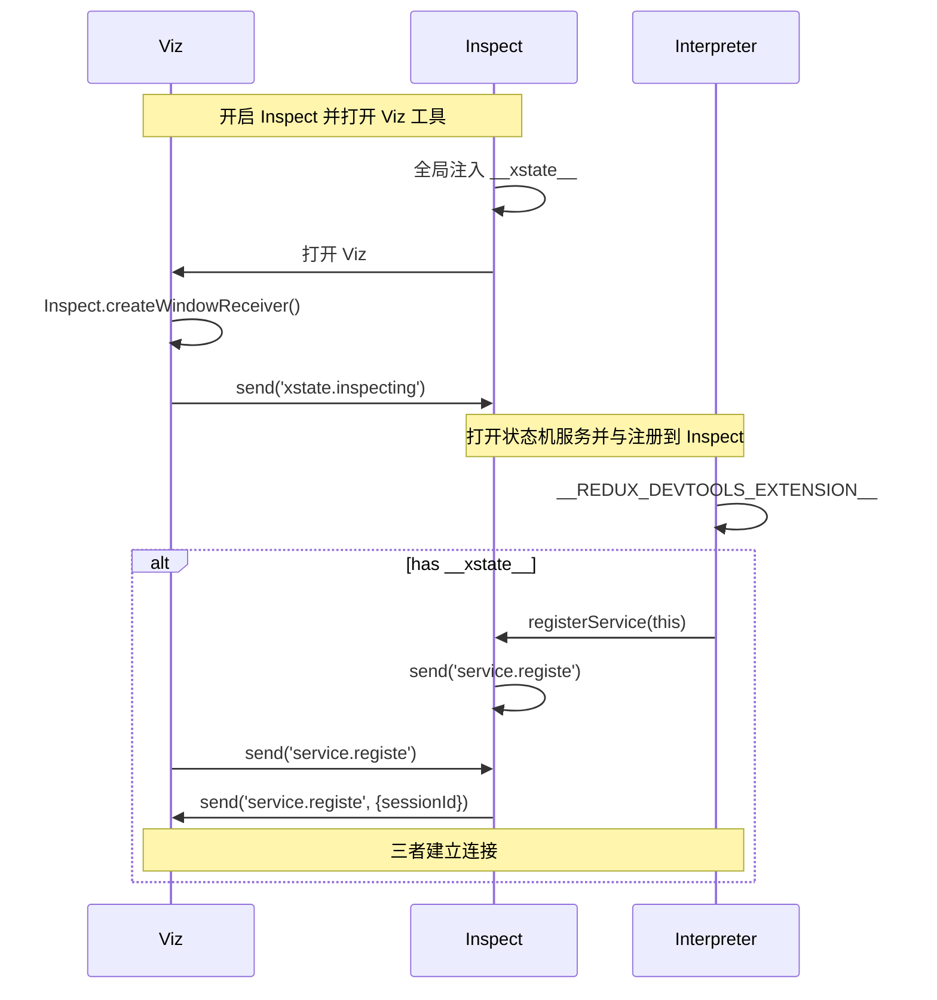

# 1. 前言
状态机的一大好处就是可以可视化状态，降低业务的理解成本和相互间的沟通成本。

目前 XState 官方提供的可视化工具已经做的很不错了，但用起来偏重，国内访问也比较慢。这边我再原基础上进行了优化，并增加了部分新功能，开发了 Viz-Lite 版。

# 2. Viz-Lite

[Viz-Lite 可视化工具地址](https://apis.leping.fun/viz)


主要有如下功能：
- 直接在右侧区域进行编写或粘贴 XState 状态机代码，右侧进行可视化。
- 可以在左侧可视化区域通过点击进行状态机执行。
- 可以在右侧事件面板中查看事件历史，且可以手动进行自定义事件发送。
- 可以通过 `@xstate/inspect` 与页面中的状态机实时建立连接，可视化查看当前页面状态机细节。
- 可以将可视化出来的状态图进行图片导出。
- 可以切切亮/暗色。

等等。

# 3. Inspect 底层实现

Viz-Lite 可以实时与页面中的状态图建立数据连接，需要依赖 `@xstate/inspect`，且在页面、Inspect、Viz-Lite 建立有严格的依赖关系。

我大致梳理了一下三者的关系，如下的序列图所示：



类似于 HTTP 三次握手。

在 Viz-Lite 中建立连接主要依靠 `@xstate/inspect` 的 `createWindowReceiver` 方法。

Viz-Lite 向 页面状态机发送事件，可以使用 `createWindowReceiver` 返回值中的 `send` 方法，消息体中 `type` 必须是 `xstate.event`。

页面中状态机的变化，可以通过  `createWindowReceiver` 返回值中的 `subscribe` 方法进行订阅，包括 `service.state` 和 `service.event`。监听 `service.stop` 可以确定连接的断开。

# 4. 接入调试方法

安装 `@xstate/inspect`：

```
npm i -S @xstate/inspect
```

从上面的序列图中也可以看出，`inspect` 必须在 `interpret()` 之前执行，不然无法连接：


```js
import { inspect } from '@xstate/inspect';

inspect({
  url: 'https://apis.leping.fun/viz?inspect',
  iframe: false
});
```

- `url` 中指定 Viz-Lite 的地址 `https://apis.leping.fun/viz?inspect`。
- `iframe` 指定在哪里挂载 Viz-Lite。可以直接指定一个 DOM，也可以设置为 `false`，浏览器会打开一个新页面。

> 注意：调试模式，必须在 Viz-Lite 的地址中加上 `?inspect`。如果想默认关闭右侧面板可以加上 `?inspect&panel=false`。

然后在创建状态机服务时，指定 `devTools` 标志位就可以了：

```js
import { interpret } from 'xstate';

const service = interpret(someMachine, { devTools: true });
```

可以访问这个 [地址](https://lecepin.github.io/xstate-example/tpl/) 查看效果：


[Github 代码地址](https://github.com/lecepin/xstate-example/blob/master/tpl/src/index.js)

# 5. 快捷键
- `+ / -` 或者 `CMD + 滚轮上/下`：缩放。
- `CMD + Enter`: 可视化当前代码。
- ` ↑↓←→`：平移视图。同时按住 `Shift`，增大平移服毒。
- `Shift + 1`：适配到到窗口大小。 


# 6. 配合 Redux DevTools 使用

从序列图中可以看到在开启 `devTools: true` 的时候，会判断是否有 `__REDUX_DEVTOOLS_EXTENSION__`，如果有的话也可以在 Redux DevTools 中查看事件信息，如下图所示：


