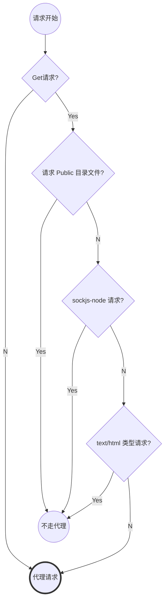

# 1. 背景
很多情况下，为了测试需要一些接口的 mock 场景，基于 create-react-app 生产的项目 好处在于它内置了这块代理的能力，给用户提供了很大的方便。

# 2. 代理方式
create-react-app 默认提供了两种方式，关联到 webpack-dev-server 中：
- 简单方式：在 `package.json` 中添加 `proxy` 字段，指定你的 mock server 地址就可以。
- 高级方式：在 `src` 下创建 `setupProxy.js` 文件，使用 http-proxy-middleware 来实现。

这两种方式都不用执行 `npm run eject` 就可以使用。

## 2.1 简单方式
如我的 mock server 是 `http://localhost:4000`，则在 `package.json` 中配置：

```javascript
{
	...
	"proxy": "http://localhost:4000"
	...
}
```

代理流程在 react-script 中内置写好了，流程如下：



> 只拦截当前域名下的请求。

## 2.2 高级方式
react-script 在 `react-scripts/config/webpackDevServer.config.js` 中通过如下判断，将 `setupProxy.js` 作为中间件放在 dev server 中：

```javascript
if (fs.existsSync(paths.proxySetup)) {
  require(paths.proxySetup)(app);
}
```

在 `src` 下创建`setupProxy.js` 文件，基本结构如下：

```javascript
const proxy = require("http-proxy-middleware");

module.exports = function (app) {
  app.use(
    "/api", // 代理 /api 的请求
    proxy({
      target: "http://localhost:4000",
      logLevel: "debug",
      changeOrigin: true,
    })
  );
};
```

上例会拦截所有 `/api` 的请求。此模式可以拦截一切请求，详情参考：[文档](https://github.com/chimurai/http-proxy-middleware/tree/v0.21.0#readme)。

> 这个 `app` 就是 express 的实例，可以在 `use` 中添加任何中间件，[详情参考](https://expressjs.com/zh-cn/guide/using-middleware.html)。

> 无需安装 `http-proxy-middleware`，已经内置在 react-script 中。
> 注意 `http-proxy-middleware` 的版本，上例中的版本是 0.x，新版本改动很大。
> 不要和 2.1 中的简单方式混用。

# 3. Mock Server
简单使用的话，直接用 `http` 创建一个就行。

## 3.1 创建 Server
可以创建一个 `mock.js` 文件用来做这个 Server：

```javascript
const http = require("http");
const PORT = 4000;

http
  .createServer(function ({ method, url }, res) {
    const search = new URL(url, `http://localhost:${PORT}`).searchParams;

    if (method == "POST") {
      // ……
    }

    if (method == "GET") {
      // 模拟延迟
      if (search.get("t")) {
        return setTimeout(() => res.end(), search.get("t"));
      }

      return res.end(
        JSON.stringify({
          success: true,
          content: "from mock",
        })
      );
    }
  })
  .listen(PORT);

```

## 3.2 同时启动 Server

在 `package.json` 中的 `scripts` 加一个并行执行就可以了：

```javascript
  "scripts": {
    "start": "react-scripts start",
    "start:with:mock": "node mock.js & npm run start"
  },
```

启动：

```javascript
npm run start:with:mock
```

