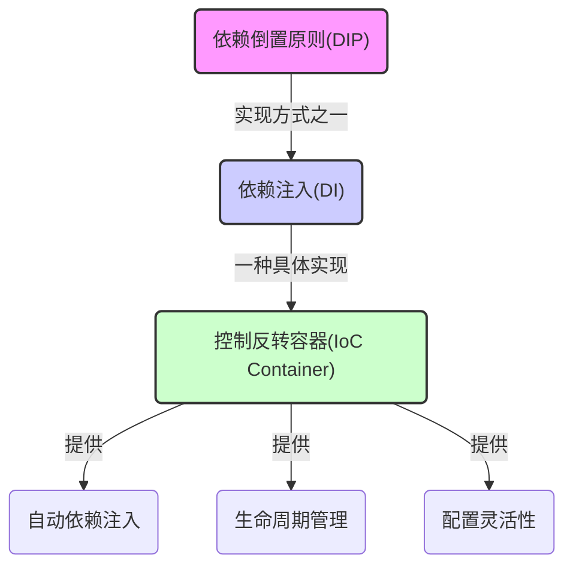

## 1. 依赖注入

在 JavaScript 中，依赖注入（Dependency Injection，简称 DI）是一种软件设计模式，通过这种模式，可以减少代码模块之间的紧耦合。依赖注入允许开发者将模块的依赖关系从模块的内部转移到外部，从而使得模块更加独立、可测试和可维护。

在 JavaScript 中实现依赖注入，通常有几种方式：

1. 构造函数注入：通过构造函数接收依赖项。
2. 属性注入：通过设置对象的属性来提供依赖项。
3. 方法注入：通过调用方法来传递依赖项。

## 2. 概念理清

结论先行，先看下相关的三个概念：DIP，DI，IoC：



### 2.1 DIP

依赖倒置原则（Dependency Inversion Principle, DIP）是面向对象设计原则的一部分，是 SOLID 原则中的 "D"。它鼓励程序员设计模块间的交互时依赖抽象（接口或抽象类），而不是具体的实现。DIP 的目的是减少高层模块（策略决定者）和低层模块（依赖细节）之间的直接依赖关系，这有助于降低系统的耦合度，提高模块的可复用性和可维护性。

DIP 的两个关键点是：

1. 高层模块不应依赖于低层模块。两者都应该依赖于抽象。
2. 抽象不应依赖于细节。细节应依赖于抽象。

在 JavaScript 中，我们没有接口或抽象类这样的语言结构。但是，我们可以使用函数或对象来模拟这些抽象概念。下面是一个使用 JavaScript 实现 DIP 的示例:

```javascript
// 定义一个抽象的“Logger”接口
function Logger() {
  this.log = function (message) {
    throw new Error("This method should be overridden");
  };
}

// 创建一个具体的“ConsoleLogger”实现
function ConsoleLogger() {
  Logger.call(this);

  this.log = function (message) {
    console.log(message);
  };
}

// 创建一个高层模块“App”，依赖于抽象的“Logger”
function App(logger) {
  this.logger = logger;

  this.run = function () {
    this.logger.log("App is running");
  };
}

// 通过依赖注入“ConsoleLogger”实现到“App”
const consoleLogger = new ConsoleLogger();
const app = new App(consoleLogger);

app.run(); // 输出: App is running
```

在这个例子中，我们定义了一个 `Logger` 抽象，它只包含一个 `log` 方法。`ConsoleLogger` 是 `Logger` 的一个具体实现，它将信息打印到控制台。`App` 是一个高层模块，它不直接依赖于 `ConsoleLogger`，而是依赖于 `Logger` 抽象。我们通过依赖注入将 `ConsoleLogger` 实例传给了 `App`。

这样，如果我们需要更改日志方式（例如，改为文件日志或远程日志服务），我们只需创建一个新的 `Logger` 实现，并在创建 `App` 时注入它。`App` 不需要任何改动，因为它只依赖于 `Logger` 抽象。这样就实现了依赖倒置原则，使得 `App` 和日志的具体实现之间的耦合度降低，提高了代码的可维护性和可扩展性。

### 2.2 DI

DI 是一种设计模式，用于实现 DIP。在这种模式中，对象的依赖关系不是由对象自身创建或查找，而是由外部实体（比如构造函数、方法、属性注入）提供给对象。
DI 的实现通常涉及一个容器，该容器负责创建对象、管理它们的生命周期，并根据配置将依赖项注入到对象中。
DI 增加了代码的模块性，并简化了单元测试和系统配置。

### 2.3 IoC

控制反转（Inversion of Control, IoC）是一种广泛的设计原则，它可以通过很多方式实现，例如依赖注入（DI）、事件、委托等。IoC 的核心思想是将程序中的控制流程的决定权从程序代码转移给外部容器或框架。

依赖注入容器（DI 容器）经常与控制反转（IoC）容器混用或视为同义词。

在传统的编程中，我们的代码直接控制所有的决策和逻辑流程。而当我们使用 IoC 时，流程的控制被反转：不再是我们的代码调用框架或库，而是框架或库调用我们的代码。这通常通过回调函数、事件监听、插件系统或依赖注入等方式实现。

下面是一个简单的 JavaScript 示例，展示了如何使用回调函数来实现控制反转的概念：

```javascript
// 假设我们有一个数据处理器，它从外部获取数据处理逻辑
function DataProcessor() {
  this.process = function (data, processData) {
    // 控制反转发生在这里，我们不直接处理数据，
    // 而是将数据处理逻辑的控制权交给回调函数 `processData`
    return processData(data);
  };
}

// 这是我们的应用程序代码，提供了数据处理逻辑
function myDataProcessor(data) {
  // 实际的数据处理逻辑
  console.log("Processing data:", data);
  return data.map((item) => item * 2);
}

// 创建 DataProcessor 的实例
const processor = new DataProcessor();

// 数据
const numbers = [1, 2, 3, 4, 5];

// 使用 DataProcessor 处理数据，并提供我们自己的数据处理逻辑
const processedData = processor.process(numbers, myDataProcessor);
console.log("Processed data:", processedData);
// 控制台输出：
// Processing data: [1, 2, 3, 4, 5]
// Processed data: [2, 4, 6, 8, 10]
```

在这个例子中，`DataProcessor` 类有一个 `process` 方法，它接受数据和一个处理数据的回调函数。`DataProcessor` 并不知道数据将如何被处理，它只知道存在一个可以调用的 `processData` 函数。这里，`DataProcessor` 调用了外部提供的 `myDataProcessor` 函数来处理数据。这样，控制数据如何被处理的逻辑就从 `DataProcessor` 反转给了我们的应用程序代码。

通过这种方式，`DataProcessor` 成为了一个可重用和可配置的组件，因为它不依赖于特定的数据处理逻辑。我们可以轻松地为不同的场景提供不同的数据处理回调函数，而无需修改 `DataProcessor` 的代码。

IoC 容器是一种更高级的 IoC 实现，它能够管理对象的创建、配置以及其它方面的控制流程。在 JavaScript 生态中，有些框架和库提供了 IoC 容器（例如 InversifyJS、Angular 的依赖注入系统等），这些工具可以帮助我们以声明性和组织化的方式管理依赖项和它们的生命周期。

### 2.4 总结

DIP 是一个高层的设计原则，DI 是实现这个原则的一种模式，而 IoC 是一个更广泛的原则，它表达了控制权转移的思想，并且可以通过包括 DI 在内的多种方式实现。在许多框架和库中，这些概念往往交织在一起，以支持松耦合、可测试和灵活的软件设计。

## 3. 简单实现

以下是一个不使用类型信息的 JavaScript 依赖注入容器示例：

```javascript
class DIContainer {
  constructor() {
    this.services = {};
    this.instances = {};
  }

  // 注册一个服务到容器
  register(name, definition, dependencies) {
    this.services[name] = { definition, dependencies };
  }

  // 解析一个服务，并提供实例
  resolve(name) {
    if (this.instances[name]) {
      return this.instances[name];
    }
    const service = this.services[name];
    if (!service) {
      throw new Error(`Service '${name}' not found.`);
    }
    const dependencies = service.dependencies.map((dep) => this.resolve(dep));
    const instance = new service.definition(...dependencies);
    this.instances[name] = instance;
    return instance;
  }
}

// 定义一些服务
class Logger {
  log(message) {
    console.log(message);
  }
}

class Database {
  constructor(logger) {
    this.logger = logger;
  }

  save(data) {
    this.logger.log("Data saved to the database.");
  }
}

class Application {
  constructor(database) {
    this.database = database;
  }

  doSomething(data) {
    this.database.save(data);
  }
}

// 使用 DI 容器
const container = new DIContainer();

// 手动注册服务和它们的依赖
container.register("logger", Logger, []);
container.register("database", Database, ["logger"]);
container.register("application", Application, ["database"]);

// 从容器中解析 Application 实例
const app = container.resolve("application");

// 使用 Application
app.doSomething({ name: "DI Example" });
```

在这个 JavaScript 示例中，我们在注册服务时手动指定了它们的依赖项。`DIContainer` 类负责管理依赖项的构建和解析，在构建依赖项时会遍历它们的依赖数组并递归地解析每个依赖项。

### 3.1 IoC 隔离

DI 容器通常提供不同的生命周期管理选项来控制依赖项的创建和共享。这些生命周期管理选项可以帮助防止不同组件之间由于共享同一依赖实例而导致的状态污染。以下是一些常见的依赖项生命周期选项：

1. **瞬态（Transient）**:
   每次请求依赖项时，容器都会创建一个新的实例。这意味着两个请求相同服务的组件将收到不同的实例，这避免了状态共享和潜在的污染。

2. **单例（Singleton）**:
   容器仅创建依赖项的一个实例，并且在整个应用程序的生命周期内，每次请求都会返回同一个实例。这适合无状态的服务或当确实需要共享状态时。

3. **作用域（Scoped）**:
   依赖项的生命周期绑定到特定的作用域，如 HTTP 请求、事务、对话或用户界面的生命周期。同一作用域内部的请求会共享相同的实例，而不同作用域的请求会得到不同的实例，这有助于限制状态共享的范围。

4. **工厂方法（Factory）**:
   容器可以使用自定义的工厂方法来创建依赖项，从而提供更多的控制权。工厂方法可以根据需要决定什么时候创建新实例或返回现有实例。

通过这些生命周期选项，你可以精确地控制依赖项实例的创建和共享。例如，如果你想要避免共享一个具有状态的依赖项，你可以配置该依赖项为瞬态生命周期。以下是一个简化的 JS 代码示例，演示如何在 DI 容器中使用生命周期：

```javascript
class DIContainer {
  constructor() {
    this.services = {};
  }

  // 注册服务并指定生命周期
  register(name, definition, dependencies, lifecycle = "TRANSIENT") {
    this.services[name] = {
      definition,
      dependencies,
      lifecycle,
      instance: null,
    };
  }

  // 解析服务
  resolve(name) {
    const service = this.services[name];
    if (!service) {
      throw new Error(`Service '${name}' not found.`);
    }

    // 根据生命周期返回实例
    if (service.lifecycle === "SINGLETON") {
      if (!service.instance) {
        service.instance = this.createInstance(service);
      }
      return service.instance;
    } else if (service.lifecycle === "TRANSIENT") {
      return this.createInstance(service);
    }

    throw new Error(
      `Unknown lifecycle '${service.lifecycle}' for service '${name}'.`
    );
  }

  // 创建服务实例
  createInstance(service) {
    const { definition, dependencies } = service;
    const resolvedDependencies = dependencies.map((dep) => this.resolve(dep));
    return new definition(...resolvedDependencies);
  }
}

// 示例使用
const container = new DIContainer();
container.register("logger", Logger, [], "SINGLETON");
container.register("database", Database, ["logger"], "TRANSIENT");

const db1 = container.resolve("database");
const db2 = container.resolve("database");
console.log(db1 === db2); // 输出: false，因为每次解析都会创建新的实例
```

在这个例子中，`Database` 被配置为瞬态，因此每次调用 `resolve` 都会创建一个新的实例。`Logger` 被配置为单例，所以不管调用多少次 `resolve`，它总是返回同一个实例。这种方式使得开发者可以根据需要控制依赖项的共享程度。

## 4. 使用 reflect-metadata


`reflect-metadata` 是一个 JavaScript 库，它提供了一个基于反射的 API，允许在运行时对类的元数据进行读取和操作。它是一个实现了 ECMAScript 装饰器提案中反射元数据部分的库。

在 TypeScript 或 JavaScript (使用类似 Babel 的转换器) 中，装饰器是一种特殊类型的声明，它可以被附加到类声明、方法、访问器、属性或参数上。装饰器可以用于修改类的行为，增加元数据，或者改变类成员的定义。

为什么需要 `reflect-metadata`：

1. **元数据反射**: JavaScript 默认不存储关于类的参数类型信息。在依赖注入的场景中，了解一个类的构造函数需要哪些参数，以及这些参数的类型非常重要，因为这允许依赖注入容器自动地解析并提供正确的依赖项实例。`reflect-metadata` 库允许开发者在定义类时通过装饰器添加类型元数据，并在运行时查询这些信息。

2. **标准化装饰器**: 尽管装饰器目前仍是一个 ECMAScript 提案，并未正式成为语言标准，TypeScript 已经提前支持了装饰器。`reflect-metadata` 库与 TypeScript 一起使用，为装饰器提供了存储和读取它们所需的元数据的能力。

3. **实现复杂的功能**: 在某些复杂的场景（比如自动构造函数参数注入），没有元数据的话，就需要手动指定依赖关系，这会增加代码的复杂性和冗余性。`reflect-metadata` 可以帮助自动化这个过程，使得代码更加简洁和易于维护。

请注意，`reflect-metadata` 不是强制性的。如果不使用反射来自动解析依赖关系，也可以手动在容器中注册和解析依赖项，但这就失去了依赖注入自动化管理依赖的优势。如果你的项目不需要自动化解析或者你愿意手动管理依赖关系，你可以避免使用 `reflect-metadata`。

### 4.1 基于 reflect-metadata

在 TypeScript 中，当你使用 `@Injectable()` 装饰器（或其他装饰器）并且配置文件 `tsconfig.json` 中启用了 `emitDecoratorMetadata` 选项时：

```json
{
  "compilerOptions": {
    ...
    "emitDecoratorMetadata": true,
    ...
  }
}
```

TypeScript 编译器会为装饰器所标记的类自动注入额外的元数据信息。这包括类的设计时类型信息，比如参数的类型、属性的类型等。`@Injectable()` 装饰器通常是由框架（如 Angular）提供的，并且它会标记一个类，表明该类适合注入依赖项。

下面是一个简单的例子来说明 `@Injectable()` 如何工作，并且如何使用 `Reflect.getMetadata('design:paramtypes', constructor)` 获取类型信息：

```typescript
import 'reflect-metadata';

// 假设的 @Injectable 装饰器，实际上你会用 Angular 或其他框架提供的
function Injectable() {
  return function(target: any) {
    // 装饰器逻辑，这里可以为空，因为我们依赖的是 TypeScript 自动生成的元数据
  };
}

@Injectable()
class Logger {
  log(message: string) {
    console.log(message);
  }
}

@Injectable()
class Application {
  // Logger 类型将被记录在元数据中
  constructor(private logger: Logger) {}
}

// 此时 TypeScript 编译器会为 Application 类生成元数据
// 包括构造函数参数类型的信息

// 然后我们可以使用 Reflect.getMetadata 获取这些信息
const params = Reflect.getMetadata('design:paramtypes', Application);
console.log(params); // 输出 [Logger]
```

在上面的代码中，当你编译 TypeScript 代码时，如果启用了 `emitDecoratorMetadata`，编译器会为每个使用 `@Injectable()` 装饰器的类生成一个特殊的元数据键 `design:paramtypes`，这个键存储了类构造函数的参数类型信息。

当你调用 `Reflect.getMetadata('design:paramtypes', Application)` 时，它会返回 Application 构造函数参数的类型数组。在这个例子中，我们只有一个参数 `logger`，它的类型是 `Logger` 类。

在依赖注入容器中，这个信息被用来自动地解析和注入所需的依赖项。例如：

```typescript
// DI 容器的简化示例
class DIContainer {
  // ...省略其他方法和属性...

  resolve(target) {
    const params = Reflect.getMetadata('design:paramtypes', target) || [];

    // 解析构造函数的每一个参数
    const injections = params.map(param => this.resolve(param));

    // 返回创建的类实例，使用解析的依赖项作为参数
    return new target(...injections);
  }
}

// 注册 Logger 和 Application 到 DI 容器
const container = new DIContainer();
container.register(Logger, Logger);
container.register(Application, Application);

// 解析 Application，自动注入 Logger
const app = container.resolve(Application);
app.logger.log('This is a test message.'); // 此时应该能正常工作
```

在这个简化的 DI 容器示例中，`resolve` 方法使用 `Reflect.getMetadata` 来自动解析 `Application` 需要的依赖（即 `Logger`），然后创建一个 `Application` 实例，并将解析出的 `Logger` 实例作为参数传入。这样，当你获取到 `Application` 实例时，它已经具有了一个注入的 `Logger` 实例，可以用来调用 `log` 方法。

## 5. 适合场景

依赖注入（DI）主要用于管理复杂应用中的依赖关系，特别是当你有多个组件需要相同的依赖或者依赖需要在不同的上下文中有不同的实现时。这种模式可以提高代码的可维护性、可测试性和模块化。以下是一些适合使用依赖注入的场景示例：

1. **大型应用的开发**：
   对于大型应用，尤其是复杂的单页面应用（SPA）或服务器端应用，依赖注入能够帮助你管理众多的服务和组件。例如，你可能有一个用户认证服务、日志记录服务和数据访问服务，这些服务可能被用在不同的业务模块中。使用 DI 可以让你在需要的地方轻松地提供这些服务的实例。

2. **单元测试**：
   在单元测试中，你通常要隔离测试的组件，以确保测试的是单独的单元而不是整个系统。使用依赖注入，你可以轻松地为组件提供模拟（mock）对象或存根（stub）来取代真实的依赖，从而确保测试的独立性和准确性。

3. **可替换的组件**：
   当你希望能够轻松地替换应用中的某些组件时，例如更换不同的数据库访问库或第三方服务。依赖注入可以让你在不修改组件内部代码的情况下进行替换。

4. **跨环境运行**：
   如果你的应用需要在不同的环境中运行，比如开发、测试和生产环境，你可能需要根据环境使用不同的配置或服务实例。DI 容器可以帮助你根据当前环境注入正确的依赖。

5. **插件式架构**：
   对于插件式架构的应用，依赖注入能够提供一种方式来动态地加载和配置插件，以及在插件之间建立依赖关系。

6. **复杂的生命周期管理**：
   当你需要更精细地控制某些服务的生命周期（例如单例、请求作用域等）时，依赖注入框架通常提供这些功能，让你不必手动管理对象的创建和销毁。

如果你的 JavaScript 工程相对简单，没有遇到上述这些情况，你可能不需要使用依赖注入。依赖注入带来的好处在于它可以帮助管理复杂性，但如果复杂性不是问题，那么引入它可能反而会让事情变得更加复杂。在较简单的应用或脚本中，手动管理依赖往往就足够了。

## 6. inversify 库


InversifyJS 是一个轻量级的、强大的依赖注入（DI）容器，用于 JavaScript 和 TypeScript 应用程序。它使用了 TypeScript 的类型系统和装饰器来提供类型安全的依赖注入，并且在 JavaScript 中也可以通过具体的配置使用。InversifyJS 让开发者能够编写更低耦合、更可测试和更可管理的代码。

InversifyJS 主要特点和功能如下：

1. **类型安全**：InversifyJS 充分利用了 TypeScript 的类型系统，尽管它也可以在 JavaScript 中使用。在 TypeScript 中，它允许开发者以类型安全的方式进行依赖注入。

2. **装饰器支持**：InversifyJS 使用 TypeScript 装饰器来定义和注入依赖，这使得依赖关系的配置非常直观且易于管理。

3. **容器**：InversifyJS 提供了一个容器，你可以在其中注册和解析你的依赖项。容器能够根据预定义的绑定关系解析依赖，实现依赖的自动注入。

4. **绑定**：开发者可以通过绑定将抽象与具体实现关联起来。这意味着你可以告诉 InversifyJS 当请求一个特定的接口或类时，应该返回哪个实现。

5. **作用域**：InversifyJS 支持不同的作用域（例如单例和瞬态），允许你定义如何管理依赖项的生命周期。

6. **中间件**：InversifyJS 允许你在解析依赖时插入自定义逻辑，这通过中间件功能实现，这可以用于日志记录、授权、监控等。

以下是一个使用 InversifyJS 的基本示例：

```typescript
import { injectable, inject, Container } from 'inversify';

// 定义一个 Logger 接口
interface ILogger {
    log(message: string): void;
}

// 定义一个 Logger 实现并将其标记为可注入
@injectable()
class Logger implements ILogger {
    log(message: string) {
        console.log(message);
    }
}

// 定义一个需要依赖的类
@injectable()
class App {
    private logger: ILogger;

    constructor(@inject('ILogger') logger: ILogger) {
        this.logger = logger;
    }

    run() {
        this.logger.log('App running...');
    }
}

// 创建 InversifyJS 容器
const container = new Container();

// 设置依赖关系
container.bind<ILogger>('ILogger').to(Logger);
container.bind<App>(App).toSelf();

// 解析依赖并运行
const app = container.get<App>(App);
app.run();
```

在这个示例中，我们首先定义了一个 `ILogger` 接口和一个 `Logger` 类，然后我们定义了一个 `App` 类，它依赖于 `ILogger`。在 InversifyJS 容器中，我们绑定了 `ILogger` 接口到 `Logger` 类的实现，并且告诉容器如何创建 `App` 的实例。最后，我们从容器中获取 `App` 的实例并运行它。

通过这种方式，InversifyJS 使得我们的代码更加模块化，并且降低了各个组件之间的耦合，便于管理和测试。

## 7. inversify 关键特性

InversifyJS 是一个功能丰富的控制反转（IoC）容器，它提供了许多先进的特性来支持复杂的依赖注入（DI）场景。以下是 InversifyJS 文档中列出的一些关键特性及其简要说明：

1. **支持类（Support for classes）**:
   允许直接将类绑定到 DI 容器中，容器将负责创建这些类的实例。

2. **支持符号（Support for Symbols）**:
   使用 ES6 的 `Symbol` 作为绑定的标识，为依赖项提供了唯一的键。

3. **容器 API（Container API）**:
   提供了一系列的 API 方法来管理绑定、解析依赖项和配置容器。

4. **声明容器模块（Declaring container modules）**:
   允许将绑定组织成模块，这样可以更容易地管理大型应用程序中的依赖项。

5. **容器快照（Container snapshots）**:
   容器状态的快照和回滚功能，可以临时改变容器状态且不影响其原始配置。

6. **控制依赖的作用域（Controlling the scope of the dependencies）**:
   管理依赖项的生命周期，例如单例、瞬态、请求作用域等。

7. **声明可选依赖（Declaring optional dependencies）**:
   允许注入的依赖项是可选的，即使没有提供绑定也不会导致错误。

8. **注入常量或动态值（Injecting a constant or dynamic value）**:
   除了类之外，也可以将常量值或动态生成的值注入到组件中。

9. **注入类构造函数（Injecting a class constructor）**:
   允许注入类的构造函数而不是类实例，这对于需要工厂模式的场景非常有用。

10. **注入工厂（Injecting a Factory）**:
    提供一种方式来注入一个工厂，该工厂可以创建依赖项的实例。

11. **自动工厂（Auto factory）**:
    自动化工厂的创建，减少了必须手动编写工厂的需求。

12. **注入提供者（Injecting a Provider）**:
    注入一个异步工厂（Provider），可以返回一个 Promise，用于异步解析依赖项。

13. **激活处理器（Activation handler）**:
    在依赖项被解析时执行额外的逻辑。

14. **中间件（Middleware）**:
    允许在解析依赖项的过程中加入自定义逻辑。

15. **多重注入（Multi-injection）**:
    同时注入多个绑定到相同标识符的依赖项。

16. **带标签的绑定（Tagged bindings）**:
    通过标签来区分不同的绑定，即使它们绑定到相同的标识符。

17. **创建自定义标签装饰器（Create your own tag decorators）**:
    可以自定义标签装饰器来进一步细化绑定。

18. **具名绑定（Named bindings）**:
    通过名称来区分不同的绑定。

19. **默认目标（Default target）**:
    在没有明确指定绑定时提供一个默认的绑定目标。

20. **支持层次化 DI 系统（Support for hierarchical DI systems）**:
    容器可以是层次化的，允许在不同层级上覆盖绑定。

21. **上下文绑定和 @targetName（Contextual bindings & @targetName）**:
    根据注入的上下文来选择不同的绑定。

22. **属性注入（Property injection）**:
    直接将依赖项注入对象的属性，而不是通过构造函数。

23. **循环依赖（Circular dependencies）**:
    提供了处理循环依赖的机制。

24. **继承（Inheritance）**:
    支持在类继承层次结构中使用依赖注入。

InversifyJS 的这些特性使得它成为处理复杂依赖注入场景的强大工具，尤其是在大型应用程序中。开发者可以根据需要选择合适的特性来构建可维护和可扩展的软件系统。

### 7.1 特性示例

下面我将针对 InversifyJS 中提到的一些特性给出简化的示例代码。请注意，由于特性多且复杂，以下只是简单的示例，仅供参考。

#### 注入类构造函数（Injecting a class constructor）

```typescript
import { Container, injectable, inject } from "inversify";

@injectable()
class Logger {
    log(message: string) {
        console.log("Default Logger: " + message);
    }
}

@injectable()
class App {
    private loggerConstructor: new () => Logger;

    public constructor(@inject("Newable<Logger>") loggerConstructor: new () => Logger) {
        this.loggerConstructor = loggerConstructor;
    }

    run() {
        const logger = new this.loggerConstructor();
        logger.log("App started");
    }
}

const container = new Container();
container.bind<Logger>(Logger).toSelf();
container.bind<new () => Logger>("Newable<Logger>").toConstructor(Logger);

const app = container.get<App>(App);
app.run();
```

#### 注入工厂（Injecting a Factory）

```typescript
import { Container, injectable, inject, Factory } from "inversify";

@injectable()
class Logger {
    log(message: string) {
        console.log("Logger: " + message);
    }
}

type LoggerFactory = () => Logger;

@injectable()
class App {
    private createLogger: LoggerFactory;

    public constructor(@inject("Factory<Logger>") createLogger: LoggerFactory) {
        this.createLogger = createLogger;
    }

    run() {
        const logger = this.createLogger();
        logger.log("App started using factory");
    }
}

const container = new Container();
container.bind<Logger>(Logger).toSelf();
container.bind<LoggerFactory>("Factory<Logger>").toFactory<Logger>((context) => {
    return () => {
        return context.container.get<Logger>(Logger);
    };
});

const app = container.get<App>(App);
app.run();
```

#### 支持层次化 DI 系统（Support for hierarchical DI systems）

```typescript
import { Container, injectable } from "inversify";

@injectable()
class Logger {
    log(message: string) {
        console.log("Logger: " + message);
    }
}

const parentContainer = new Container();
const childContainer = new Container({ defaultScope: "Singleton", parent: parentContainer });

parentContainer.bind<Logger>(Logger).toSelf();
const parentLogger = parentContainer.get<Logger>(Logger);
parentLogger.log("Logged from parent");

childContainer.bind<Logger>(Logger).toSelf();
const childLogger = childContainer.get<Logger>(Logger);
childLogger.log("Logged from child");

// 子容器从父容器继承绑定，但可以覆盖
```

#### 注入提供者（Injecting a Provider）

```typescript
import { Container, injectable, inject, Provider } from "inversify";

@injectable()
class Logger {
    log(message: string) {
        console.log("Logger: " + message);
    }
}

type LoggerProvider = () => Promise<Logger>;

@injectable()
class App {
    private getLogger: LoggerProvider;

    public constructor(@inject("Provider<Logger>") getLogger: LoggerProvider) {
        this.getLogger = getLogger;
    }

    async run() {
        const logger = await this.getLogger();
        logger.log("App started using provider");
    }
}

const container = new Container();
container.bind<Logger>(Logger).toSelf().inSingletonScope();
container.bind<LoggerProvider>("Provider<Logger>").toProvider<Logger>((context) => {
    return () => Promise.resolve(context.container.get<Logger>(Logger));
});

const app = container.get<App>(App);
app.run();
```

#### 多重注入（Multi-injection）

```typescript
import { Container, injectable, inject, multiInject } from "inversify";

interface IService {
    doWork(): void;
}

@injectable()
class ServiceA implements IService {
    public doWork() {
        console.log("Service A doing work");
    }
}

@injectable()
class ServiceB implements IService {
    public doWork() {
        console.log("Service B doing work");
    }
}

@injectable()
class Client {
    private services: IService[];

    public constructor(@multiInject("IService") services: IService[]) {
        this.services = services;
    }

    public performWork() {
        this.services.forEach(service => service.doWork());
    }
}

const container = new Container();
container.bind<IService>("IService").to(ServiceA);
container.bind<IService>("IService").to(ServiceB);
container.bind<Client>(Client).toSelf();

const client = container.get<Client>(Client);
client.performWork();
```

#### 循环依赖（Circular dependencies）

InversifyJS 官方文档并不推荐使用循环依赖，但如果你确实在一个复杂的情况下遇到了这种情况，可以通过工厂或提供者来解决，例如：

```typescript
import { Container, injectable, inject, interfaces } from "inversify";

@injectable()
class ServiceA {
    private serviceBFactory: () => ServiceB;

    public constructor(@inject("Factory<ServiceB>") serviceBFactory: () => ServiceB) {
        this.serviceBFactory = serviceBFactory;
    }

    public doWork() {
        const serviceB = this.serviceBFactory();
        serviceB.helpWithWork();
    }
}

@injectable()
class ServiceB {
    constructor(private serviceA: ServiceA) {}

    public helpWithWork() {
        console.log("Service B helping");
    }
}

const container = new Container();
container.bind<ServiceA>(ServiceA).toSelf();
container.bind<ServiceB>("Factory<ServiceB>").toFactory<ServiceB>((context: interfaces.Context) => {
    return () => {
        return context.container.get<ServiceA>(ServiceA);
    };
});

const serviceA = container.get<ServiceA>(ServiceA);
serviceA.doWork();
```

以上代码示例展示了如何解决循环依赖问题。`ServiceA` 依赖于一个可以创建 `ServiceB` 实例的工厂函数，而 `ServiceB` 依赖于 `ServiceA`。通过使用工厂函数，我们可以延迟 `ServiceB` 的创建，直到 `ServiceA` 实例化和准备好后。
