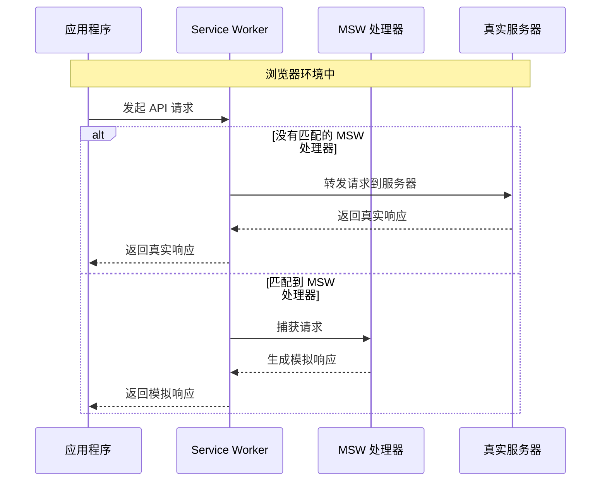

## 1. msw

`msw`（Mock Service Worker）是一个流行的库，用于在前端应用程序中拦截和模拟网络请求。它通常用于在开发和测试阶段模拟 API 请求的响应，而无需依赖后端服务的实际实现。

`msw` 利用了 Service Worker API 来拦截发出的 HTTP 请求，并可以返回自定义响应。这样的话，开发者可以编写测试来验证应用程序的行为，而无需依赖真实的后端服务，同时也可以模拟后端服务的各种行为，比如网络延迟、错误响应等。

## 2. 诞生背景

`msw`（Mock Service Worker）的诞生背景和主要用途与前端开发和测试中遇到的一些常见问题有关。以下是几个关键点，说明了 `msw` 是如何应对这些挑战的：

1. 依赖后端服务：在传统的开发流程中，前端开发往往依赖于后端服务的实时可用性和稳定性，这可能导致前端开发和测试受限于后端服务的状态。`msw` 允许开发者在不依赖真实后端服务的情况下模拟 API 请求和响应，这样即便后端服务不可用，前端的开发和测试工作仍可继续进行。

2. 控制测试场景：在进行自动化测试时，控制测试数据和网络条件是非常重要的，以确保测试的一致性和可靠性。使用 `msw`，开发者可以精确地模拟各种网络情况（如成功响应、错误、延迟等），这样有助于编写更全面和健壮的测试用例。

3. 减少引入第三方模拟服务的需求：在 `msw` 出现之前，开发者常常需要搭建专门的模拟服务器或使用第三方服务来模拟后端 API。这些方法往往更复杂，管理起来也更麻烦。`msw` 作为一个轻量级的库，可以直接集成到现有的前端项目中，无需额外的基础设施。

4. 环境一致性：无论是在本地开发环境、CI/CD 管道中还是在不同的开发者之间，确保一致的环境是很有挑战的。使用 `msw` 可以保证无论在哪个环境中，API 的模拟响应都是一致的，从而减少因环境差异导致的问题。

5. 对现代开发工具的良好兼容：随着前端开发工具和框架的不断进化，需要一种能够与现代开发实践相适应的模拟解决方案。`msw` 支持 Service Worker API，并与现代 JavaScript 模块系统和工具链（如 Webpack、Rollup、Vite 等）良好集成。

总的来说，`msw` 的诞生是为了提供一种简单、可靠且与现代前端开发实践相结合的方式来模拟网络请求，从而解决依赖真实后端服务和环境不一致性等问题，优化开发和测试流程。

## 3. 其他 Mocks 对比

Mock Service Worker 与类似工具的比较。


¹ 虽然可以处理 GraphQL 请求，但需要额外设置，并非一流支持。  
² JSON Server 本身不在浏览器中运行，但可以从浏览器中请求。

#### Mock Service Worker 定义示例

```javascript
http.get("/users", async ({ request }) => {
  const payload = await request.json();
  return HttpResponse.json({ id: 1, name: "John" });
});
```

#### Nock 定义示例

```javascript
nock("https://api.example.com")
  .get("/user")
  .reply(200, { id: 1, name: "John" });
```

#### JSON Server 定义示例

```json
{
  "posts": [
    { "id": 1, "title": "json-server" },
    { "id": 2, "title": "mock-service-worker" }
  ]
}
```

#### Mirage 定义示例

```javascript
createServer({
  models: {
    movie: Model.extend({
      castMembers: hasMany(),
    }),
    castMember: Model.extend({
      movie: belongsTo(),
    }),
  },
  routes() {
    this.get("/movies", () => {
      return ["Interstellar", "Inception", "Dunkirk"];
    });
  },
});
```

#### Cypress 定义示例

```javascript
cy.intercept("POST", "/users", {
  statusCode: 201,
  body: req.body,
  delay: 100,
});
```

#### Playwright 定义示例

```javascript
page.route("/fruits", async (route) => {
  const request = route.request();
  if (request.method === "POST") {
    const response = await route.fetch();
    const json = await response.json();
    json.push({ name: "Playwright" });
    return route.fulfill({ response, json });
  }
  route.continue();
});
```

Mock Service Worker 旨在使用标准的 Fetch API 类进行请求拦截和响应模拟，无需对代码进行更改和配置，可以在各种环境中使用。

## 4. 哲学思想

#### 模拟作为一个独立层

Mock Service Worker (MSW) 在概念上与其他 API 模拟解决方案既相似又迥异。它能够拦截外发请求并模拟响应，但与任何特定的测试或开发工具无关。这种细微的区别带来了 MSW 能提供的多数好处。

我们认为 API 模拟应该在应用程序中占据自己的层。能够随时随地控制网络在各种情况下都可能非常有用，比如测试与网络相关的代码，或重现和调试特定的网络场景。当 API 模拟仅作为其他工具的一个功能时，这种控制水平是无法实现的，因为你总会受限于那些工具。而使用 MSW 就没有这些限制。

#### 模拟与网络行为

在文档中，我们较少使用“模拟”这个术语。有一个强烈的趋势是，开发者开始将模拟视为肮脏、不可靠和不正当的行为。MSW 力求改变这种看法。

MSW 致力于在拦截外发网络流量时采取最小侵入性方式。这意味着使用浏览器中指定的 Service Worker 或在 Node.js 中实现自定义的请求拦截算法，而不需要对代码进行任何更改。我们努力尊重你的应用程序，并为此创造了一个新术语 — 网络行为。

网络行为是对网络预期状态的类似合同的描述：“当请求 X 发生时，响应 Y。”这正是使用 MSW 时你将会处理的抽象级别，并且是一个易于阅读、扩展和维护的级别。

#### 使用平台

过去使用过的 API 模拟解决方案在语法和实现方面有很大的差异。从方法链到控制器定义，总有大量特定知识需要记在心中，而这些知识往往不适用于特定工具之外。

我们将开发者教育视为开发者体验的不可分割的一部分。我们不断努力将你需要了解的与库特定相关的知识量降到最低。相反，我们依赖标准 API 和平台功能，这样你实际上就会学习如何处理请求和响应。

我们采纳了 WHATWG Fetch API 规范，这意味着每个被拦截的请求都是一个实际的 Request 实例，每个模拟的响应都是一个实际的 Response 实例。我们采纳 Service Worker API 在浏览器网络层拦截请求，这样你的应用程序和测试就不会知道有模拟在进行中。我们依赖语义和标准，而不是设计自定义 API 来满足特定用例。

例如，这是在 MSW 中用模拟重定向响应的方式：

```javascript
http.get("/old", () => {
  return new Response(null, {
    status: 302,
    headers: {
      Location: "/new",
    },
  });
});
```

#### 服务器的视角

当使用 MSW 时，你将编写请求处理程序来拦截和响应请求。从服务器的视角出发来处理这些处理程序是重要的，因为实际上，你正在描述服务器在特定场景下应该如何行为。

## 5. 工作原理



Mock Service Worker（MSW）是一种用于前端应用程序的网络请求模拟工具，它的工作原理基于浏览器的 Service Worker API。以下是 MSW 工作原理的概述：

1. **注册 Service Worker**：
   在使用 MSW 时，第一步是注册一个 Service Worker。这个 Service Worker 将充当你的应用程序与网络之间的代理。在注册过程中，Service Worker 脚本被下载、安装并激活，在浏览器中作为一个独立的线程运行。

2. **请求拦截**：
   Service Worker 具有监听和拦截应用程序发出的 HTTP/HTTPS 请求的能力。当通过标准的 `fetch` API 或 `XMLHttpRequest` 发出网络请求时，注册的 Service Worker 可以捕获这些请求。

3. **模拟响应**：
   在 MSW 中，开发者定义了一套请求处理器（handlers），这些处理器决定了对于特定的请求应该返回什么样的模拟响应。当 Service Worker 拦截到一个请求时，MSW 会查找匹配的请求处理器并生成一个模拟的响应。

4. **返回模拟响应**：
   生成的模拟响应随后被返回给发起请求的应用程序，就像它是从实际的服务器返回的一样。这个过程对于应用程序代码来说是透明的，模拟的请求和响应不需要改变任何应用程序逻辑。

5. **在 Node.js 中的使用**：
   虽然 Service Worker API 是浏览器特有的，但 MSW 还提供了 Node.js 的支持，允许在 Node 环境中通过类似的机制拦截和模拟网络请求。这对于服务器端渲染的应用程序或者需要在 Node.js 环境下运行的测试特别有用。

6. **开发和测试的便利性**：
   使用 MSW，开发者可以在不依赖后端服务的情况下进行前端开发和测试。它使得开发者能够模拟慢速网络、服务端错误及不同的网络情况，这对于编写可靠的测试非常有帮助。

7. **标准化的请求和响应**：
   MSW 使用标准的 `Request` 和 `Response` 对象来处理模拟的请求和响应。这意味着使用 MSW 不需要学习新的 API，因为它依赖于现代浏览器中已经存在的 API。

总结来说，MSW 的工作原理是通过浏览器的 Service Worker API 在网络请求级别进行拦截和模拟。这种方法使得模拟的过程与应用程序代码完全解耦，并且允许开发者控制网络行为，从而提高了前端开发和测试的灵活性和效率。

## 6. 安装

要使用 Mock Service Worker（MSW）对网络请求进行模拟，你需要按照以下步骤进行安装和使用：

### 安装 MSW

首先，使用 npm 或 yarn 在你的项目中安装 MSW 作为开发依赖。

使用 npm 安装：

```bash
npm install msw --save-dev
```

使用 yarn 安装：

```bash
yarn add msw --dev
```

### 初始化 MSW

创建一个 Service Worker 文件来配置你的请求处理器。通常，你可以在项目的根目录下创建一个名为 `mocks` 的目录，并在其中创建一个名为 `handlers.js` 的文件来定义模拟的路由和响应。

```javascript
// src/mocks/handlers.js
import { http, HttpResponse } from "msw";

const allPosts = new Map();

export const handlers = [
  http.delete("/posts/:id", ({ params }) => {
    // All request path params are provided in the "params"
    // argument of the response resolver.
    const { id } = params;

    // Let's attempt to grab the post by its ID.
    const deletedPost = allPosts.get(id);

    // Respond with a "404 Not Found" response if the given
    // post ID does not exist.
    if (!deletedPost) {
      return new HttpResponse(null, { status: 404 });
    }

    // Delete the post from the "allPosts" map.
    allPosts.delete(id);

    // Respond with a "200 OK" response and the deleted post.
    return HttpResponse.json(deletedPost);
  }),
];
```

接下来，在同一目录下创建一个名为 `browser.js` 的文件来设置并启动 Service Worker。

```javascript
// src/mocks/browser.js
import { setupWorker } from "msw";
import { handlers } from "./handlers";

// 使用上面定义的处理器初始化 MSW Service Worker
export const worker = setupWorker(...handlers);
```

### 集成 MSW 到你的开发环境中

在你的应用程序的入口文件中，例如 `index.js`，根据你的环境条件启动 Service Worker。

```javascript
// src/index.jsx
import React from "react";
import ReactDOM from "react-dom";
import { App } from "./App";

async function enableMocking() {
  if (process.env.NODE_ENV !== "development") {
    return;
  }

  const { worker } = await import("./mocks/browser");

  // `worker.start()` returns a Promise that resolves
  // once the Service Worker is up and ready to intercept requests.
  return worker.start();
}

enableMocking().then(() => {
  ReactDOM.render(<App />, rootElement);
});
```

确保在生产环境中不启动 MSW，因为你不希望在生产中使用模拟的 API。

### 运行你的应用程序

现在，当你在开发环境中运行你的应用程序时，所有到 `/user` 端点的 GET 请求都会被 MSW 拦截并返回模拟的响应。

使用你的项目中的开发服务器启动你的应用程序，例如通过运行 `npm start` 或 `yarn start`，然后在浏览器中访问应用程序。你应该能够看到 MSW 拦截请求并提供模拟数据。
